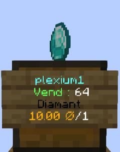
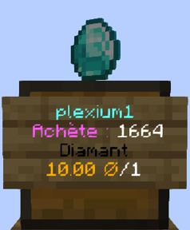
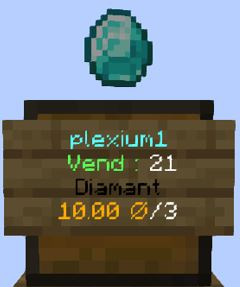
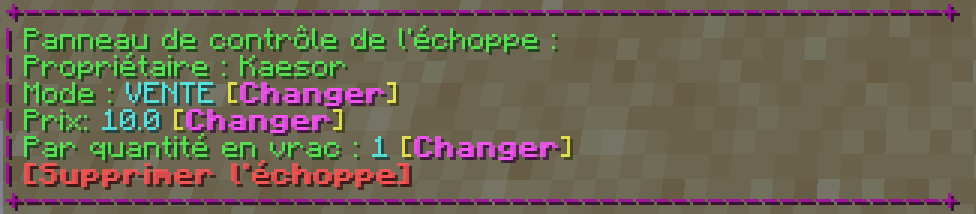

# Le Commerce

## Introduction

Le commerce est très présent sur le serveur. Il existe plusieurs façon tel que l'échange entre les joueurs, ou encore les échoppes.

Nous vous présentons ici chaque possibilité.

## L'échange entre joueurs

Avec un simple `accroupi + clique droit`, ou la commande `/trade [pseudo]`, tu peux envoyer une demande d'échange au joueur indiqué. Lorsque le joueur accepte la demande, le menu d'échange s'ouvre.


Il n'est possible de faire un échange qu'entre joueur distancé de moins de 10 blocs.


.png>)

Il est possible d'échanger des ressources, des items, des Orez, et ceux-ci sans contrepartie. Chaque joueur à 22 emplacements disponibles.\
Sur la gauche, ce sera toujours ton côté, c'est ici que tu déposeras tes items ou ressource à échanger. De l'autre côté, tu verras ce que le joueur t'échange en retour.\
Pour échanger des Orez, il suffit de cliquer sur le tournesol (qui ressemble à une pièce d'or).

Enfin, il suffit d'accepter l'échange en cliquant sur le bouton jaune, qui deviendra vert. Et d'attendre 3 secondes pour que l'échange soit effectué (un décompte sonore est présent lorsque les deux joueurs ont acceptés).

Si le joueur en face, ou toi, quitte le menu, cela annulera la proposition d'échange pour les deux joueurs.

## L'hôtel des ventes

Orezia propose aux joueurs de vendre n'importe quelles ressources à n'importe quel prix par le biais de l'hôtel des ventes. Il faut aller voir **Comher Sant**, qui se situe à l'hôtel des ventes au spawn.\
Par un simple clique droit, il t'ouvre le menu :

Le menu est composé en plusieurs parties :

* En haut à gauche :&#x20;
  * Entonnoir : rechercher les ventes d'un item ou ressource particulière, ou bien les ventes d'un joueur en particulier
  * Montre : voir les ventes faites dans les 72 dernières heures
* En haut à droite : fermer le menu
* En bas à gauche :
  * Lingot d'or : ton argent actuel
  * Livre enchanté : voir ton historique de vente (en cours, expirées, vendues, achetées et annulées)
* En bas à droite : créer une nouvelle vente
* Au centre : les différents items ou ressources rangées par catégorie.

Dépendant de ton rang joueur au sein du serveur, tu n'auras pas le même nombre d'emplacement de vente possible. Les grades premium te débloquent un nombre élevé d'emplacements, pour en savoir plus sur les grades Premium, [clique ici](../les-rangs/premium.md).

Chaque vente faite reste disponible pendant 30 jours à compter de la mise en vente. Cela risque de changer avec le temps.


Rappel : il est interdit de ventre des items avec très peu de durabilité, ou l'impossibilité de les réparer.


## Les échoppes personnelles

Une troisième façon de vendre ou acheter des ressources, c'est avec les échoppes personnelles. Il est possible de créer des échoppes exclusivement dans une ville où tu y es autorisé.\
Ces échoppes ne doivent pas être utilisé comme un coffre privé, pour protéger ses items/ressources.

Pour créer une échoppe il te suffit, d'un coffre simple ou double, et de la ressource/item à vendre ou à acheter.

Tu as deux façon pour créer ton échoppe :

* Faire un accroupi + clique gauche sur le coffre avec ton item en main. Puis indique le prix unitaire dans le tchat.
* Passer par la commande `/qs create [prix]` en regardant le coffre avec l'item voulu en main.

Ton échoppe est créée ! De base celle-ci sera en mode VENTE, et il est possible de la passer en mode ACHAT.

|                             Échoppe en mode Vente                             |                             Échoppe en mode Achat                             |
| :---------------------------------------------------------------------------: | :---------------------------------------------------------------------------: |
|   |   |

|                 Échoppe en mode Vente avec une quantité par 3                |
| :--------------------------------------------------------------------------: |
|   |

Pour modifier une échoppe, tu as deux solutions :

* Passer par le menu du tchat :

Par simple clique sur **\[Changer]** tu peux changer le mode de l'échoppe, et passer de ACHAT à VENTE et inversement.\
Lorsque tu cliques sur **\[Changer]** au niveau du prix ou de la quantité en vrac, une commande sera pré-écrite dans le tchat où il suffira d'indiquer un nombre pour changer la valeur.\
Si tu cliques sur **\[Supprimer l'échoppe]**, celle-ci est supprimée directement sans demande de confirmation

* Passer par les commandes :
  * `/qs price  [nombre]` :  change le prix de l'échoppe
  * `/qs buy`
    &#x20;:  change le mode de l'échoppe en VENTE
  * `/qs sell`
    &#x20;: change le mode de l'échoppe en ACHAT
  * `/qs remove`
    &#x20;:  supprime l'échoppe
  * `/qs size [nombre]`
    &#x20;:  change le nombre d'items/ressources vendus/achetés en même temps


**Astuce** : En mode ACHAT, il est possible de limiter le nombre de ressource que les joueurs peuvent te vendre, en plaçant un item qui n'est pas celui demandé, comme de la pierre/cobblestone par exemple.


Il est aussi possible d'ajouter des joueurs à tes échoppes en tant que gérant. Ils peuvent ainsi modifier la quantité, le prix, le mode de l'échoppe, ainsi que la quantité vendue.\
Pour cela il te suffit de faire l'une des commandes ci-dessous en regardant l'échoppe voulu :

* `/qs staff add [pseudo]` : permet d'ajouter un joueur des gérants de l'échoppe
* `/qs staff del [pseudo]` : permet de retirer un joueur des gérants de l'échoppe
* `/qs staff clear` : permet de retirer tous les gérants de l'échoppe
* `/qs staff list` : permet d'obtenir la liste de tous les gérants actuels de l'échoppe.
