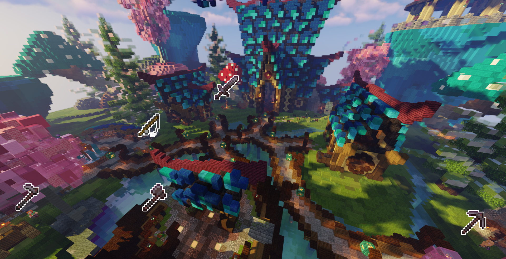

# Les Quêtes

## Introduction

Orezia est basé en grande partie sur les quêtes, que ce soit pour les rangs joueurs, ou encore la façon de gagner des orez. Il existe actuellement plus de 85 quêtes en tous genres. Elles ont toutes leur utilité, et seront omniprésente tout le long de ton aventure.

Plus tu monteras dans ton rang de joueur, plus les quêtes que les PNJ peuvent te fournir deviedront intéressantes. Mais attention à ne pas les mettre en colère, ceux-ci peuvent aussi te donner des quêtes de qualité basse.

## La rareté d'une quête

Au nombre de 7, la rareté d'une quête indique la difficulté de celle-ci, et pour certaines son pourcentage de chance de l'obtenir. Elles sont caractérisées par une couleur qui leur est propre :

1. **Basse :** gris
   e
2. **Normale :** blanche
3. **Commune :** vert
   e
4. **Rare :** bleu
   e
5. **Epique :** violet
   te
6. **Légendaire :** orange
7. **Exotique :** jaune

Les quêtes Légendaires sont celles effectuable une fois par année, tel que les quêtes saisonnier (Noël, Halloween, etc.).\
Les quêtes Exotique sont celles effectuable une fois sur le serveur, tel que les quêtes de rang (Errant II, Errant I, etc.).

## Les types de quête

### Quêtes de rang

Branche principale des quêtes sur Orezia, c'est par ce biais que tu peux monter dans la [hiérarchie](/broken/pages/-MYfZbAspBG4DDTsasbX). Elles sont de couleur jaune, et obtenable en parlant avec Rhank Eup au spawn.

### Quêtes de vote

* **Quêtes accessible grâce aux points de vote :**

Tu peux en prendre une chaque jour à condition d'avoir terminé la précédente. Il est possible de retomber sur une même quête plusieurs fois d'affiler si tu mets plus de 24h à la rendre, à compter du moment où tu récupères la quête journalière.

Comme sur de nombreux serveur Minecraft, les votes sont un moyen de nous aider. Et pour cela, nous te remercions par des quêtes exclusif lié au nombre de tes points de vote.\
Elles sont récupérable avec la commande `/voter`, puis dans la boutique de vote. Lorsque tu récupères l'une d'elle, les points de vote sont consommés.\
\
Il existe 2 quêtes, chacune demande de nombreuse ressource, mais te récompensent correctement en retour. Elles demandent 25 ou 100 points de vote et sont répétables tant que tu disposes de points de vote.

* **Quêtes de vote journalières :**

Il existe 4 quêtes de vote que tu peux réaliser chaque jours si tu votes suffisamment dans la journée. Pour les débloquer, il te faudra voter jusqu'à 20 fois par jour. Ces quêtes sont disponibles devant la taverne auprès de **Grhap Derézin**.\
La première quête se débloque à 5 votes, la seconde à 10 votes, la troisième à 15 et la dernière à 20 votes.

* **Quêtes de vote mensuelles :**

Ces quêtes se débloquent avec les votes mensuels du serveur, elles sont disponibles à la Taverne au spawn auprès d'**Ersa Skarlette**, et demandent un minimum d'investissement de ton côté. Elles demandent bien plus de ressource et sont disponibles une fois par mois. Différents paliers sont à atteindre par tous les joueurs pour débloquer les quêtes, et un certain nombre de points de vote (personnels et non consommés lors de la prise de la quête) sont requis :

* Premier palier : 1000 votes (avec 25 points de vote)
* Deuxième palier : 2500 votes (avec 75 points de vote)&#x20;
* Troisième palier : 5000 votes (avec 150 points de vote)

Tu peux savoir à combien de vote mensuel le serveur est, grâce à l'hologramme situé devant la taverne.

### Quêtes journalières

En plus des [métiers](/broken/pages/-MY_g5jcAVEXb31UKOlV) disponibles sur Orezia, des quêtes liées le sont aussi. Elles se débloquent avec votre rang et non avec le niveau de métier. Tu peux donc être niveau 50, mais toujours avoir les même quêtes car tu n'as pas atteint le rang nécessaire pour débloquer celles plus haute.

Ces quêtes sont disponibles aux maîtres de métier disséminés au Spawn :

* **Abah Tage** : Maître des Bûcherons
* **Brah Konié** : Maître des Chasseurs
* **Hagrid Culteur** : Maître des Fermiers
* **Soh Mont** : Maître des Pêcheurs
* **For Hage** : Maître des Mineurs

Tu peux en prendre une chaque jour, avec un maximum de 2 quêtes en cours. Il est possible de retomber sur une même quête plusieurs fois d'affiler si tu mets plus de 24h à la rendre, à compter du moment où tu récupères la quête journalière.

### Quêtes hebdomadaires

A partir du rang Pauvre, de nouvelles quêtes s'ouvrent à toi. C'est avec **Tave Herne**, présent au spawn dans la taverne, que tu pourras obtenir une quête hebdomadaire, qui demande une certaine quantité de ressources, mais qui te récompensera comme il se doit.

Plus tu montes dans la hiérarchie, plus le nombre de quête que tu peux avoir augmente.

### Quêtes événementielle

Comme le nom l'indique, ce sont des quêtes qui apparaissent durant certains évènements du calendrier (Pâques, Halloween, etc.). Elles reviennent une fois par an, et peuvent changer chaque année. Elles ne sont pas répétables.

