# Les Villes

## Introduction

Sur le monde que Orezia abrite, il est possible de bâtir sa propre ville, inviter de nouveaux joueur dedans, ou tout simplement en rejoindre une déjà existante.\
Mais pour cela, il est primordial de connaître le fonctionnement, et quelques commandes.

> _Les villes peuvent être utilisées de différentes manières, voilà pourquoi nous utiliserons le terme de "**projet**" de temps en temps._


Sur **Bedrock Edition**, le "clic droit" fonctionne différemment, et tu ne pourras pas faire certaines actions directement depuis le menu, il faudra donc passer par le biais des commandes.


Si tu souhaites rejoindre un projet déjà existant, il te suffit de voir avec le maire ou les adjoint(e)s de cette ville, pour qu'ils puissent t'ajouter au terrain, et pourvoir profiter des avantages potentiels de la ville.\
Un maire a le droit de refuser un joueur dans son projet, si celui-ci n'est pas prêt à accueillir, ou que ce n'est pas réellement une ville (le joueur l'utilise plus comme base ou stockage de masse).

Dépendant de ton rang ville ou joueur au sein du serveur, il t'est possible d'appartenir à une ou plusieurs villes, et d'être propriétaire d'une ou plusieurs villes. Pour plus d'informations sur les avantages de chaque rang : [Les Rangs](les-rangs/).

Si tu souhaites créer un projet, seul ou à plusieurs, nous te conseillons de bien lire ce tutoriel.

## Prérequis pour ton premier terrain

Avant de te lancer dans l'aventure pour créer ton projet, il faut certain **prérequis**, tel que le rang **Errant**, des **ressources**, quelques **∅rez** (monnaie du serveur), et surtout du **temps de jeu** ! Et oui, il n'est pas possible de créer une ville à l'arrivée du serveur, cela a pour but que les projets existant se développent.

Pour commencer, va voir **Jess Tionaire-Détérin**, au spawn, pour lancer la quête : `Prérequis pour son premier terrain` (lançable à partir du rang Errant) !\
Elle te permet de débloquer la commande `/rangville` , qui te permet de monter en rang de ville, et agrandir les possibilités de ton projet, que ce soit en terme de taille, du nombre de joueur pouvant la rejoindre, ou même l'accès à un spawn de ville.


Cette commande montre les items/ressources nécessaire au rang de ville supérieur au tient. Il n'est donc pas possible de savoir à l'avance les ressources nécessaires pour les rangs suivant.


Chaque rang te débloque un nombre de claim (chunk) possible et un nombre total de joueur pouvant rejoindre ton projet.\
Pour chacun d'eux, il te sera demandé différentes ressources en grande quantité, de l'argent ainsi que du temps de jeu minimum. Plus tu avances dans les rangs, plus les items/ressources demandés sont importants.

Quand tu aura fini les deux étapes pour le rang "Terrain vague", tu auras accès à la création de ton premier terrain !

## Les commandes

> Les commandes sont présentées ainsi : /commande \<variable obligatoire> \[variable facultatif]

* **/ville** : ouvre l’interface des villes.

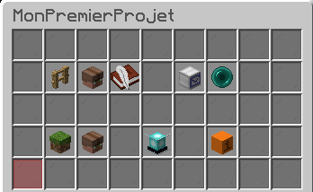

* **/ville create \<nom de la ville>** : fonde une ville avec le nom choisi (disponible à partir du rang de ville Terrain vague). Attention à ne pas mettre d'espace dans le nom lors de la création.
* **/ville delete \<nom de la ville>** : supprime une ville entière (sans remboursement des orez).
* **/ville edit** : sélectionne la ville à modifier.
* **/ville accept \<nom de la ville>** : accepte une invitation à rejoindre la ville choisi.
* **/ville chat \[nom de la ville] \<message>** : permet d’écrire un message visible en jeu uniquement par les membres de la ville choisie.
  &#x20;Si le nom de la ville n'est pas indiqué, le message sera envoyé à la ville où tu te situes.
* **/ville claim** : achète le chunk dans lequel vous vous trouvez.
* **/ville unclaim** : supprime un chunk dans une ville (sans remboursement des orez).
* **/ville selection \[pos1/pos2]** : permet de sélectionner une zone, utile pour acheter plusieurs chunks en même temps si suivi de la commande **/t claim** ou pour délimiter une parcelle à l’intérieur de votre ville.
  * Possible d'utiliser le clic droit et gauche pour sélectionner, ou succéder la commande de pos1 et pos2 (utile pour les Bedrock Editions).
* **/ville selection assign \<nom de la parcelle>** : permet d’assigner une sélection à une parcelle créée précédemment.
* **/ville selection expand** : permet d’étendre la sélection à l’infini en profondeur et en hauteur.
* **/ville leave \<nom de la ville>** : permet de quitter la ville choisie.
* **/ville setowner \<pseudo>** : permet de déléguer le rôle de maire à un autre joueur. Cela coûte 500 orez.
* **/ville setspawn** : disponible au rang niveau 5 (Bourg), permet de créer un point de spawn dans ta ville pour permettre aux joueurs autorisés à se téléporter à ce point (coûte 5000 orez). Il est possible de le déplacer plus tard pour 100 orez en exécutant la même commande à l'endroit souhaité.
* **/ville trust \<pseudo> \[nom de la parcelle / \*]**  : permet d'ajouter un joueur à la parcelle indiqué ou sur toutes les parcelles en même temps (\*).
  &#x20;Si la parcelle n'est pas indiqué, c'est la parcelle Zone Commune (parcelle principale) qui sera considéré.
* **/ville untrust \<pseudo> \[nom de la parcelle / \*]** : permet de retirer un joueur à la parcelle indiqué ou sur toutes les parcelles en même temps (\*).
  &#x20;Si la parcelle n'est pas indiqué, c'est la parcelle Zone Commune (parcelle principale) qui sera considéré.
* **/ville setrole \<pseudo> \<nom de la parcelle / \*> \<rôle>** : permet de promouvoir ou rétrograder un joueur au rôle voulu sur la parcelle indiqué ou sur toutes les parcelles en même temps (\*).
* **/ville list** : montre la liste des villes qui possèdent un tp. Cliquez sur la tête du joueur pour vous téléporter à la ville correspondante.
* **/ville map** : permet de voir les chunks directement depuis le chat. Schématisé par des carrés de couleur.
* **/ville view** : permet de voir les limites de la ville et des parcelles directement en jeu et visible par des particules de redstone de couleur verte (propriétaire), jaune (membre) ou rouge (non membre).
* **/ville balance \[ville]** : montre l'argent disponible dans la banque de ville.
* **/ville deposit \[ville] \<montant>** : permet de déposer de l'argent dans la banque de ville.
* **/ville withdraw \[ville] \<montant>** : permet de retirer de l'argent dans la banque de ville.

## Guide sur les fonctionnalités


**Pour les Bedrock Edition :**

* Certaines fonctionnalités ne sont pas disponibles, il faudra donc passer par la commande.
* Le GUI est bien différent, comme les mini-blocs ne sont pas disponible sur cette édition. Il faudra donc passer sa souris/curseur sur les têtes de joueurs pour savoir à quoi ils correspondent.


### Revendiquer une ville

Le claim de ta ville se fait **chunk par chunk** (zone de 16 par 16 blocs). Pour avoir un repère visuel de la délimitation de chaque chunk, fais **F3 + G** (_sur Java Edition uniquement_).


Lors des commandes où de l'argent est requis (claim par exemple), l'argent sera retiré depuis la banque de ville (`/ville bank`)


Le premier chunk de ta ville te coûtera **100 orez**. Chaque chunk suivant te coûtera **10 orez + 0.1/chunk**. C’est-à-dire que ton 2e chunk te coûtera 10,1 orez, ton 3e chunk te coûtera 10,2 orez, ton 4e chunk 10,3 orez, etc.

Afin de claim ton premier chunk, places toi à l’endroit de ton choix dans le monde Orezia et fais la commande `/ville create <nom de la ville>`. Le nom de ta ville ne doit pas comprendre entièrement ou partiellement le nom du serveur. Tu possèdes maintenant le premier chunk de ta future ville.

Pour agrandir ton claim, tu as deux solutions :

* Te balader de chunk en chunk en faisant la commande `/ville claim` (attention, les chunks doivent être adjacents à ta ville pour pouvoir y être ajoutés).
* Faire la commande `/ville selection`, puis sélectionner ensuite avec clic gauche un coin, avec clic droit un autre coin (en diagonale). Une fois la sélection faite, la commande `/ville claim` revendiquera tous les chunks compris dans la sélection.

Par sécurité et afin de ne pas te tromper, il est conseillé de faire `/ville edit` sur ta ville avant de claim les chunks. Cela force l'édition de la ville sur laquelle tu te situes, ce qui peut éviter les messages d'erreur si tu as plusieurs terrains.


Tu peux t'aider de la map 3d pour voir l'emplacement et la délimitation de ta ville (/map en jeu puis le menu en haut à gauche, ensuite "Balises" et enfin "Terrain").

### Les rôles

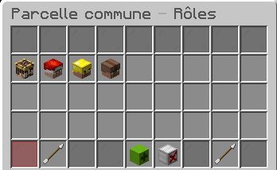

Plusieurs rôles sont disponibles par défaut dans ta ville :

* **Maire** : le joueur qui a créé la ville
  .
* **Adjoint** : un joueur qui aura des accès privilégiés dans ta ville comme délimiter des parcelles, les attribuer ou encore casser et poser des blocs dans l’ensemble de la ville.
* **Habitant** : un joueur qui appartiendra à la ville mais en aura un accès limité
  .
* **Visiteur** : tout joueur n'appartenant pas à la ville.

Pour **promouvoir un joueur** sur sa ville principal, tu as deux possibilités:

* Aller dans l'interface de ta ville avec `/ville`, cliquer sur la barrière ("Zone Commune et Parcelles") afin d’entrer dans l’interface des parcelles, cliquer sur Zone Commune (si c'est pour la ville générale) ou une parcelle (si c'est pour une parcelle particulière) et cliquer sur "Membre de la parcelle". Ensuite fais un clic gauche sur le joueur pour le promouvoir au rôle au-dessus du sien, ou clic droit pour le rétrograder. (Il n'est pas possible de rétrograder un joueur au rang de Visiteur)
* Faire la commande `/ville setrole <pseudo> <parcelle> <rôle>`, ce qui ajoute le joueur au rôle que vous lui attribuez dans la parcelle. Si tu souhaites qu'un joueur est le même rôle partout : `/ville setrole <pseudo> * <rôle>`

Si un propriétaire promeut (upgrade) le rôle d’un joueur sur son terrain principal, le joueur n'aura pas le même rôle sur toutes les parcelles existantes ou futures.

Si un propriétaire rétrograde un joueur sur le terrain principal, le joueur gardera cependant son rôle le plus élevé dans toutes les parcelles existantes où il est .


Lors de la création d'une parcelle, les membres de la Zone Commune, ne sont pas automatiquement membres de cette parcelle. Si tu souhaites que certains aient accès automatiquement à cette parcelle, il faut aller dans l'interface de ta ville avec `/ville`, cliquer sur "Rôles", cliquer sur le rôle souhaité, et cliquer sur la barrière : "Appliquer des membres à de nouvelles parcelles".

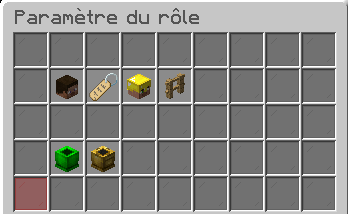

Tu peux éditer les droits de chaque rôle dans l’interface de ta ville (`/ville` puis "Rôles"). Les joueurs auront des accès différents selon s’ils sont ajoutés au terrain en entier ou à une parcelle en particulier.

Tu peux également renommer les rôles par défauts, créer de nouveaux rôles sur mesure ou modifier l'icone pour tes habitants ou tes amis selon tes envies !

Enfin, tu peux modifier les paramètres d'action ou de gestion du rôle. L'un permet par exemple d'autoriser le joueur de casser des blocs ou même d'entrer dans la parcelle. L'autre permet d'ajouter des claims, d'ajouter un autre joueur à la ville.

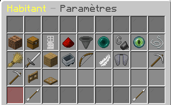 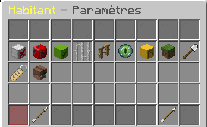

### Délimitation des parcelles

La délimitation des parcelles se fait en 3 dimensions x, y et z.

Pour **créer une nouvelle parcelle**, entre tout d’abord dans l’interface de ta ville avec la commande `/ville` et cliquez sur ton terrain.

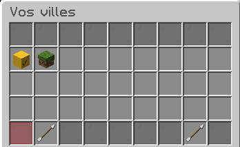

Les blocs de terre brute sont les villes rejoints, les blocs d'herbe sont tes villes (que tu as créé toi-même ou dont tu es le maire).

Clique ensuite sur la barrière ("Zone Commune et Parcelles")
\
Tu es maintenant dans l’interface qui gère les parcelles.

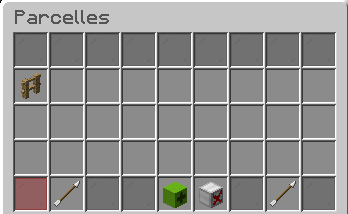

Si des parcelles ont déjà été créées, elles seront représentées par des barrières et tu peux voir leurs noms en passant ta souris dessus. Pour créer une nouvelle parcelle, clique sur le bloc de gauche en bas ("+" vert ou tête de joueur).

La parcelle "Zone Commune" (première parcelle de la liste) est la parcelle par défaut, elle correspond à ta ville entière.

Tu dois alors donner un nom à cette parcelle : écris le nom de celle-ci dans le tchat (ne met surtout pas d'espace dans le nom).

Une fois la parcelle créée, il va falloir l’**assigner à une zone** dans votre terrain. Pour cela fais la commande `/ville selection`. Ensuite avec clic gauche et clic droit, sélectionnez les deux coins de la parcelle. Si tu souhaites faire une sélection en 3D il faut bien penser à prendre en compte la profondeur et la hauteur ! Si tu souhaites que la parcelle soit « illimitée » en terme de profondeur et de hauteur, fais la commande `/ville selection expand`. Une fois la sélection faite (tu peux en voir les contours grâces aux particules de redstone en faisant `/ville view`), il faut l’assigner à la parcelle que tu as créé juste avant avec la commande `/ville selection assign <nom de la parcelle>`.

A savoir qu'il existe 4 couleurs différentes pour les particules de redstone :

|                                  Maire                                  |                                 Membre                                 |
| :---------------------------------------------------------------------: | :--------------------------------------------------------------------: |
| 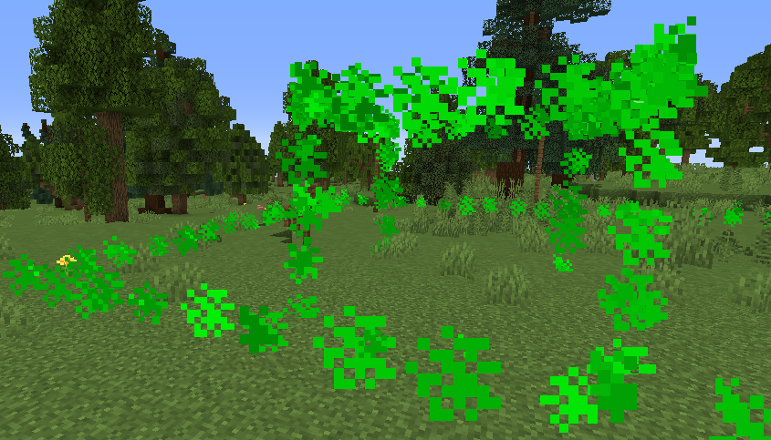  | 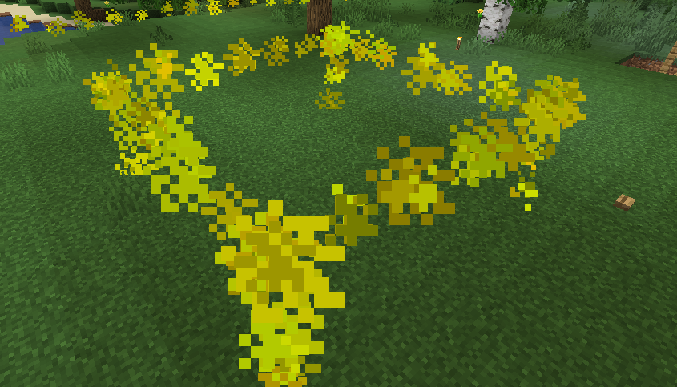  |

|                                Visiteur                               |                                 Sélection                                 |
| :-------------------------------------------------------------------: | :-----------------------------------------------------------------------: |
| 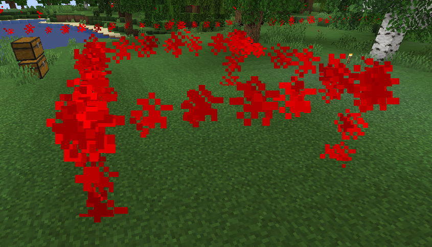  | 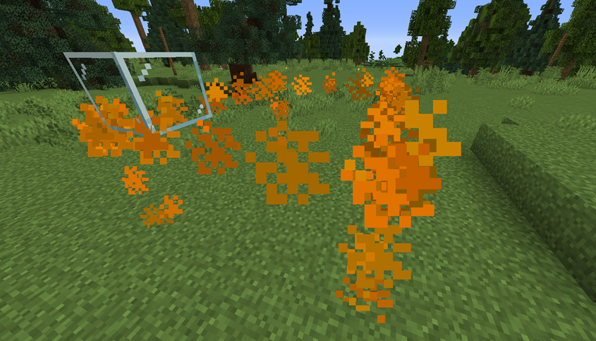  |

Enfin, sur chaque parcelle il est possible de modifier ce qu'il te plait, que ce soit son nom, son icône affiché dans le menu principale des parcelles, les rôles présents à l'intérieur ou encore les paramètres.

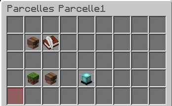

C'est aussi depuis ce menu, qu'il t'est possible d'inviter un joueur directement dans la parcelle choisie, en cliquant sur la livre avec la plume.

### Inviter un membre

Tu as une limite quant aux nombres d'habitants au sein d'une ville, dépendant du [rang de ville](/broken/pages/-MYfZgYaJz9pqch4S_zm#les-rangs) atteint. Sache qu'il n'est pas obligatoire que le joueur soit connecté lorsque tu l'invites.

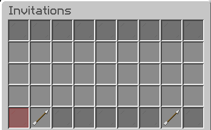

Pour **ajouter un joueur**, fais la commande `/ville trust <pseudo> <nom de la parcelle>`. Si tu ne mets pas le `<nom de la parcelle>`, tu ajouteras le joueur sur la parcelle Zone Commune, qui correspond à la parcelle principale.

Si tu souhaites ajouter le joueur partout, indiquez-le par une étoile ( \* ) au lieu du nom de la parcelle : `/ville trust <pseudo> *`

Pour **enlever un joueur** d'une parcelle, fais la commande : `/ville untrust <pseudo> <nom de la parcelle>`. Si tu avais ajouté le joueur dans plusieurs parcelles, et que tu souhaites l'enlever de partout, indique-le par une étoile ( \* ) : `/ville untrust <pseudo> *`
.

Si un maire invite un joueur sur sa parcelle principal, le joueur n'aura pas automatiquement le même rôle sur toutes les parcelles existantes.

Si un maire invite un joueur directement sur une parcelle, le joueur ne sera ni membre de la parcelle principales, ni des autres parcelles existantes ou futures.


Quand tu invites un joueur, fais bien la distinction entre inviter le joueur à ta ville entière ou à une parcelle en particulier ! Si le rôle Habitant a le pouvoir de casser les blocs et que tu l'ajoutes à la ville entière, alors le joueur en question pourra casser dans la totalité de ton terrain.


