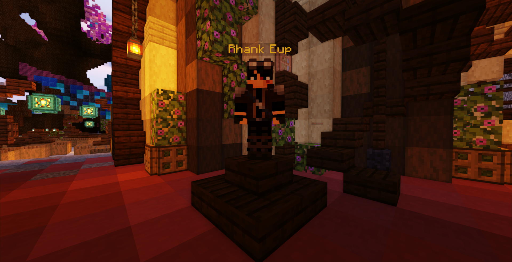
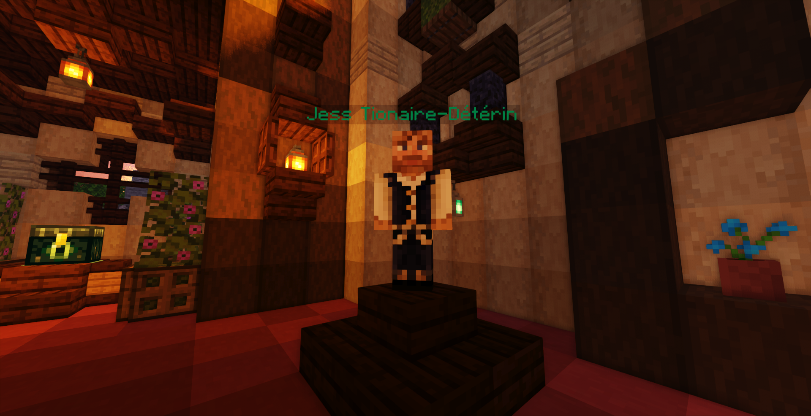

# Serveur Semi-RP

## Bienvenue sur le serveur !

Tu viens de te connecter sur le serveur pour la première fois, bienvenue à toi !\
Sache qu'au moment de ta première connexion, tu te trouves au tutoriel, termine le afin de pouvoir commencer ton aventure. Tu seras ensuite téléporté au Spawn, c'est ici que tu reviendras après tes morts mais c'est aussi le lieu où tu pourras prendre toutes sortes de quêtes liées à ton métier, ton rang ou voir ton nombre de votes.\
\
Tu es perdu pour le moment ? Ne t'inquiète pas, tout est détaillé ci-dessous alors n'hésite pas à lire et relire ce tutoriel à tout moment !

## But du jeu

Sur le serveur Semi-RP, le but est de monter dans la hiérarchie !\
Pour cela, rien de plus simple, il te faudra monter de rang auprès de Rhank Eup (PNJ situé au spawn), il te donnera tous les pré-requis afin de monter ton [rang](https://wiki.oreziamc.fr/guides/les-rangs/joueur), à savoir quel niveau de métier, d'expérience vanilla et d'objets il te faudra pour valider ta montée dans la hiérarchie.

Bien sûr, il est tout à fait possible de jouer sans monter de rangs mais chaque nouveau rang t'apportera un avantage non négligeable ! Tel que le rang Pauvre qui te permettra de te créer ton propre terrain sur le monde d'Orezia (monde construction).

Évidemment, ce n'est pas le seul objectif, chacun a les siens. Que ce soit créé ton royaume, explorer de nouveaux horizons, devenir le plus riche,... Chaque aventure est unique !&#x20;

## Premiers pas

### • Choix du métier

Tout d'abord, il faut que tu choisisses un métier car toute ton aventure dépendra de lui ! \
Pour cela rends-toi auprès de **Maître Deméh Tié** au **spawn** et parle lui afin de choisir l'un des 5 métiers que propose le serveur. (tu auras normalement déjà choisis ton métier si tu as terminé le tutoriel). Il te permettra aussi de changer de métier une fois par jour.


Attention, tu perdras tous tes niveaux si tu quitte ton métier


\
Une fois ton métier choisi, il te faudra ensuite l'exercer afin d'augmenter ton niveau métier (les niveaux de métiers sont des pré-requis pour monter de rang), équipe toi de ton outil préféré et au travail !


_Sache que tu pourras accomplir une **quête métier** chaque jour qui t'apportera quelques récompenses !_\
_Pour savoir où trouver le PNJ correspondant à ton métier et avoir quelques informations plus précises concernant tous les métiers, rends-toi sur la page_ [_**Les Métiers**_](https://wiki.oreziamc.fr/guides/les-metiers)_._


Pour connaître l'évolution de ton métier, voir les tops de chaque métiers ou d'autres informations, il te suffira de taper **/metier** dans le tchat.

### • Les rangs

Après avoir choisi ton métier, vas voir **Rhank Eup** !

Ce PNJ te permettra de **monter ton rang**, pour avoir plus d'informations sur les différents rangs découverts à ce jour et leurs avantages, [**clique ici**](https://wiki.oreziamc.fr/guides/les-rangs/joueur) !

Si tu cliques dessus, ta nouvelle **quête de rang** démarrera et un menu s'affichera avec tous les pré-requis pour ton prochain rang.\
Les pré-requis sont affichés comme suit (attention, l'image suivante est un exemple et ne correspondra pas forcément à ce qui t'est demandé à ton niveau actuel) :

.jpg>)

Il te faudra donc monter les niveaux métiers et vanilla demandés et regrouper toutes les ressources afin de monter en rang.\
S'il y a plusieurs pages, cela veut dire que la quête se valide en plusieurs étapes. Sur l'exemple, il te faudra avoir toutes les ressources de la première page avant d'aller parler à **Rhank Eup** puis pour valider la seconde page, tu devras faire un aller/retour vers ton coffre afin de prendre la suite et repartir valider la quête auprès de lui !

Tu auras remarqué qu'il y a des objets spéciaux qui sont demandés, ce sont les **objets de métiers**. Ils sont échangeable au marché du Spawn. Tu trouveras plus d'informations ci-dessous.


[Broken link](/broken/pages/-MYfZbAspBG4DDTsasbX)


### • Ton terrain

Pour avoir ton propre terrain, il te faudra aller voir Jess-Tionnaire-Détérin !

Avant de te lancer dans l'aventure pour créer ton projet, il faut certain **prérequis**, tel que le [rang](https://wiki.oreziamc.fr/guides/les-rangs/joueur) **Pauvre**, des **ressources**, quelques **∅rez** (monnaie du serveur), et surtout du **temps de jeu** ! Et oui, il n'est pas possible de créer une ville à l'arrivée du serveur, cela a pour but que les projets existants se développent.

Pour avoir plus d'information sur les villes, [clique ici](https://wiki.oreziamc.fr/guides/les-villes) !

#### Alors comment avoir ta propre maison sans avoir de terrain ?

Rien de plus simple !&#x20;

Pour avoir ta **propre maison**, tu as plusieurs options qui s'offrent à toi :

* Tu peux décider de t'aventurer dans le **monde ressources** et construire ta base là-bas mais prends garde à t'éloigner du spawn (grâce au `/rt`) et à **bien cacher ta base** car le **pillage et le grief sont autorisés sur ce monde**. 
* Tu peux **rejoindre une ville** en tant que **membre**, tes ressources seront sécurisées et ne seront accessibles que par toi et ceux que tu auras choisis comme compagnons.\
  Pour devenir membre d'une ville, il faut qu'un propriétaire t'accorde sa confiance et qu'il décide de te recruter pour faire partie de son projet. 
* Tu peux **louer une maison** dans une **ville existante**. Certaines villes proposent des maisons à louer contre des **orez**. Il est possible de gagner des orez en votant, en effectuant des quêtes ou en faisant du commerce sur le serveur.

_Alors ne sois pas timide, si tu veux protéger efficacement tes ressources, n'hésite pas à demander dans le tchat du jeu ou sur discord pour voir si des villes recrutent, s'il y a des locations disponibles ou si d'autres personnes veulent faire équipe avec toi !_

### _•_ Les Orez

Les Orez sont la monnaie du serveur, ils te serviront à commercer avec les autres joueurs, améliorer ta future ville (les orez sont l'un des pré-requis des rangs de ville) ou d'autres choses.

Pour savoir comment gagner des Orez,[ clique ici](https://wiki.oreziamc.fr/guides/leconomie#gagner-ses-premiers-rez) !

### • La Banque

La banque d'Orezia se situe à droite du spawn, à cet endroit tu pourras stocker des ressources. \
Cela peut être très pratique pour protéger tes biens les plus précieux au début de ton aventure !


Les **rangs premium** te permettent d'accéder à la **banque** grâce à une simple commande et tu pourras aussi y stocker ton **expérience vanilla**. Pour avoir plus d'infos sur les **rangs Premium**, [**clique ici**](https://wiki.oreziamc.fr/guides/les-rangs/premium) !


### • Le monde construction - Orezia

Pour accéder au monde construction (Orezia) afin de créer ta propre ville ou en rejoindre une existante, parle avec le Maître Dékon Thinant au spawn, il pourra te téléporter aléatoirement.

## Les différents mondes d'Orezia

### **Le Monde Construction**

Tu pourras y créé ou rejoindre un ville !


[Broken link](/broken/pages/-MYfZgYaJz9pqch4S_zm)


### Le Monde Ressources

Tu peux y récolter des ressources, équipe toi bien, des monstres rôdent dans les parages !

